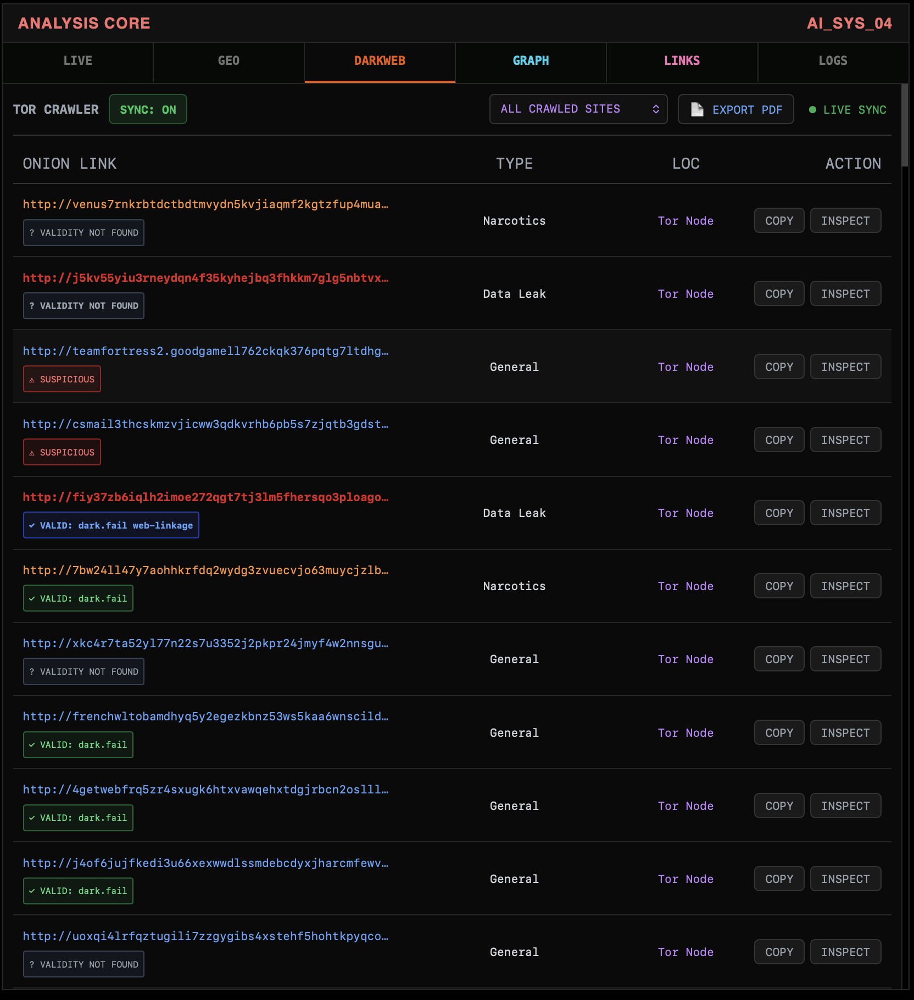
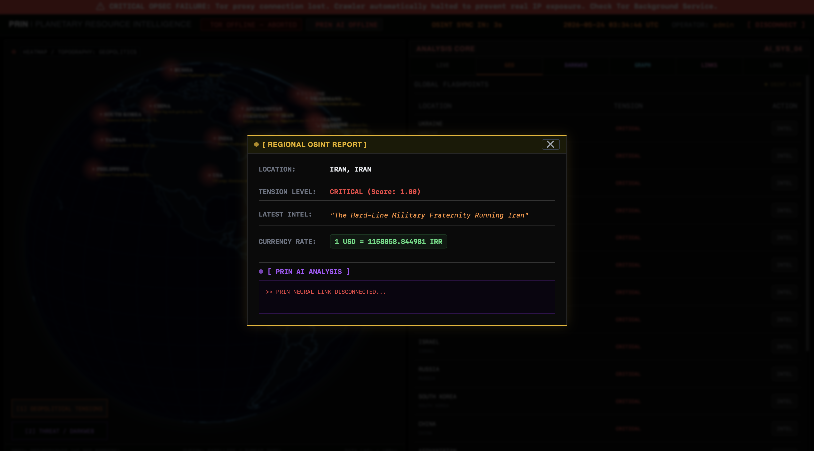

#Beest #Hackclub

# PRIN
### Planetary Resource Intelligence Network

Prin is a cyber-security platform to crawl the details of dark web host onion websites and leaked emails linked with it. Not only emails but also BTC ids, PG keys, and IP address using proper protocol proxy while hiding our own identity. This will help the cyber police to directly reduce dark market.

---

### Dashboard Overview

PRIN brings multiple intelligence views together in a single interface. Users can explore global activity, investigate relationships between discovered resources, and analyze large datasets through interactive visualizations.

---

### Correlation Graph

PRIN automatically builds a relationship graph showing how discovered resources connect to one another. This makes it possible to identify clusters, patterns, and hidden links that would be difficult to see manually.

---

### Onion Links

Collected resources are organized and classified inside the dashboard, allowing investigators to search, filter, inspect, and analyze information from a single location.

---

### Geopolitics

PRIN fetch live news to check the threats rate in the different countries based on live happenings. However an advance version of this will include AI to improve the analysis.

---

### Features

- Interactive intelligence dashboard
- Global activity visualization
- Relationship and correlation mapping
- Automated resource classification
- Search and investigation tools
- Real-time monitoring and analytics
- Graph-based exploration
- Modern web interface

### Future
- AI integration for monitering trends

---

### DNA of Project

PRIN is built using Python, Flask, SQLite/PostgreSQL, JavaScript, D3.js, Vis Network, Chart.js, and TailwindCSS.

---

## Project Links

Website: will update soon 

Documentation: will update soon 

Live Demo: will update soon
