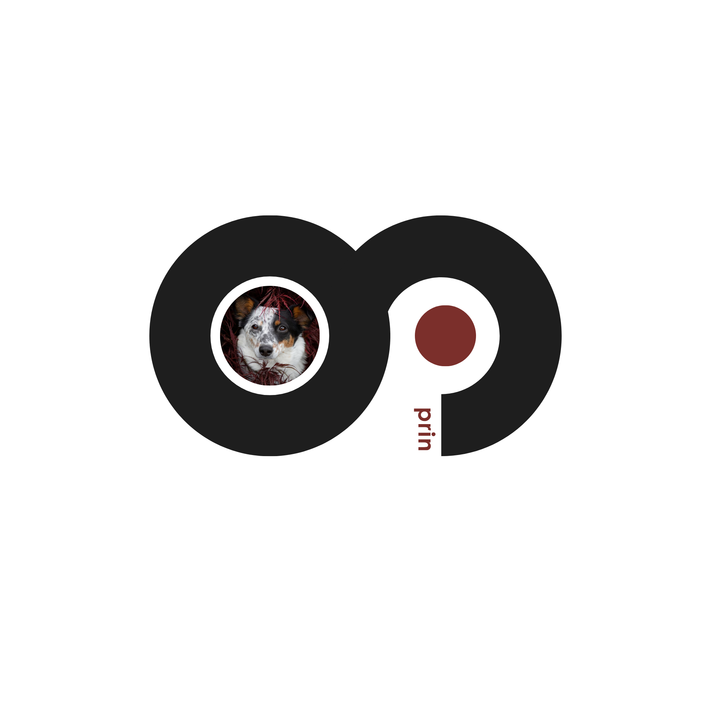

#Beest #Hackclub

# PRIN
### Planetary Resource Intelligence Network

PRIN is an intelligence and visualization platform that discovers connections across the web, organizes large amounts of information, and presents it through interactive maps, relationship graphs, and analysis dashboards.

---

## Dashboard Overview

PRIN brings multiple intelligence views together in a single interface. Users can explore global activity, investigate relationships between discovered resources, and analyze large datasets through interactive visualizations.

---

## Correlation Graph

PRIN automatically builds a relationship graph showing how discovered resources connect to one another. This makes it possible to identify clusters, patterns, and hidden links that would be difficult to see manually.

---

## Onion Links

Collected resources are organized and classified inside the dashboard, allowing investigators to search, filter, inspect, and analyze information from a single location.

---

## Features

- Interactive intelligence dashboard
- Global activity visualization
- Relationship and correlation mapping
- Automated resource classification
- Search and investigation tools
- Real-time monitoring and analytics
- Graph-based exploration
- Modern web interface

## Future
- AI integration for monitering trends

---

## Technology

PRIN is built using Python, Flask, SQLite/PostgreSQL, JavaScript, D3.js, Vis Network, Chart.js, and TailwindCSS.

---

## Project Links

Website: will update soon 

Documentation: will update soon 

Live Demo: will update soon
